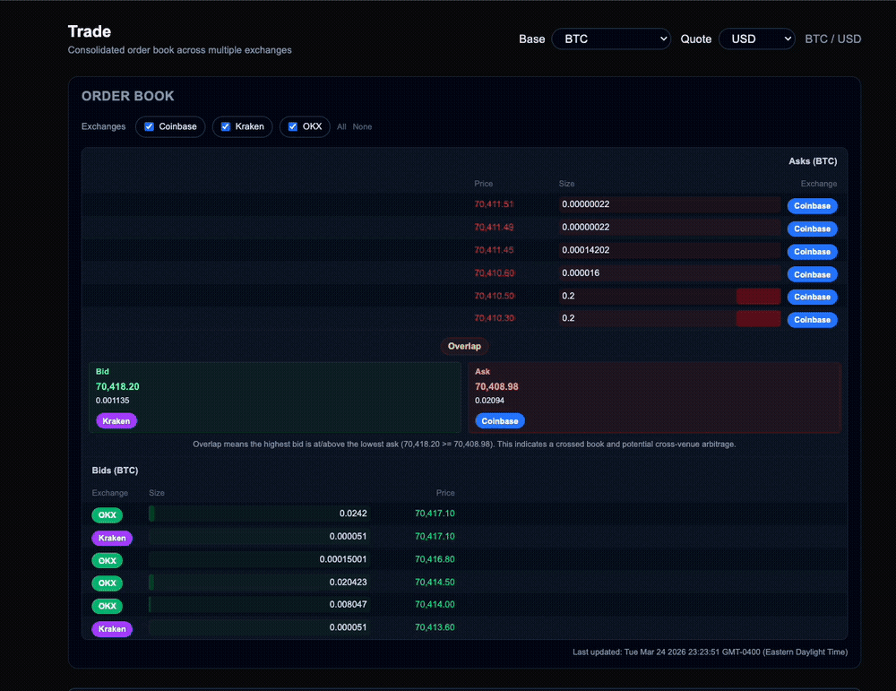

# Cryptocurrency Order Routing System

<p align="center">
  
</p>


### Run app

1) Clone the repository.
2) Then run the following on separate terminals

Backend
```bash
cd backend
make
./build/server
```

Frontend
```bash
cd frontend
npm install
npm run dev
```

Check [Technical Details](docs/Technical%20Details/Technical%20details.md) for implementation explanation